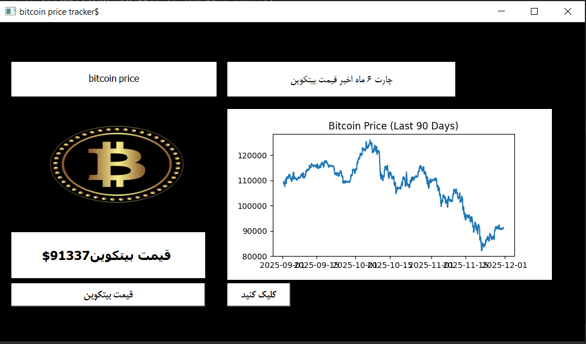

Bitcoin Price Tracker (PyQt5 + CoinGecko API)

A simple desktop application built with Python, PyQt5, and Matplotlib to display the current Bitcoin price and show a 90-day price chart using data from the CoinGecko API.

✨ Features

Fetch real-time Bitcoin price (USD)

Display a 90-day historical price chart

PyQt5 UI built with .ui file

Error handling for HTTP, connection, timeout, and server issues

🚀 Installation
```bash
pip install pyqt5 matplotlib requests
```
📌 Tech Stack

- Python 3.x
- PyQt5
- Matplotlib
- Requests
- CoinGecko API
  


